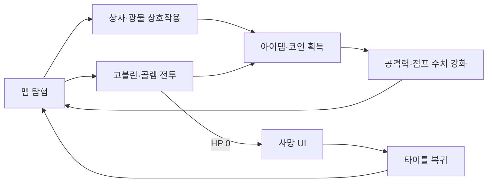

# Unreal Action Survival Prototype

> Unreal Engine 5 Blueprint로 전투, 적 AI, 상호작용과 보상 루프를 구현한 개인 액션·탐험 프로토타입입니다.

## 프로젝트 개요

| 항목 | 내용 |
|---|---|
| 개발 기간 | 2025.05.24 ~ 2025.06.20 |
| 인원 | 1명 |
| 엔진 | Unreal Engine 5.5 |
| 구현 방식 | Blueprint-only, Enhanced Input, Behavior Tree / Blackboard |
| 대상 플랫폼 | Windows, DirectX 12, Shader Model 6 |
| 현재 상태 | 코드·에셋 메타데이터 정적 검증 완료, 에디터 실행·패키징 미검증 |

116개 커밋을 통해 플레이어 전투, 장비 전환, 적 AI, 상자·아이템·광물·코인, HUD와 사망 흐름을 단계적으로 구현했습니다. 모델과 환경 에셋은 직접 제작한 것이 아니라 외부 에셋을 게임 시스템과 레벨에 통합했습니다.

## 게임 플레이 루프



## 구현 기능

### 플레이어와 전투

- Enhanced Input 기반 이동·점프와 달리기
- 검·곡괭이 장착 전환과 Aim Mode
- 공격 montage와 상·하체 분리 animation
- Line/Sphere Trace 기반 공격 판정과 `ApplyDamage`
- HP, money, attack power, jump 수치 관리

### 적 AI

- Behavior Tree, Blackboard와 AI Controller 구성
- 랜덤 순찰, 플레이어 탐색과 추적 상태 전환
- 거리 기반 공격 가능 여부와 이동 속도 갱신
- 고블린·골렘별 공격 animation과 범위 구성
- 피격·사망 처리, 데미지 숫자 팝업과 코인 드롭

### 상호작용과 보상

- `BPI_Interact`, `BPI_ItemEffect` Blueprint Interface로 상호작용 분리
- 상자 개봉과 랜덤 아이템 생성
- 이름·설명·아이콘·타입을 담는 `ItemData` 구조체
- 덤벨의 공격력 증가, 스프링의 점프 수치 증가
- 광물 피격·파괴와 코인 생성·획득

### UI와 레벨

- HP·코인·경과 시간 HUD
- 공격력·점프 수치를 표시하는 상태창
- START / QUIT 타이틀 UI
- 사망 UI와 타이틀 복귀·게임 종료 흐름
- 동굴 입구, 고블린 마을, 골렘 사원과 산악 지형으로 구성한 `MainMap`

## 구현 위치

| 영역 | 주요 에셋 |
|---|---|
| 플레이어 | [`Content/Blueprints/Characters`](Content/Blueprints/Characters) |
| AI | [`Content/Blueprints/enemy`](Content/Blueprints/enemy) |
| 상호작용 | [`Content/Blueprints/Interfaces`](Content/Blueprints/Interfaces) |
| 아이템·보상 | [`Content/Blueprints/Items`](Content/Blueprints/Items) |
| 상자·광물 | [`Chests`](Content/Blueprints/Chests), [`BreakableObject`](Content/Blueprints/BreakableObject) |
| UI | [`Content/Blueprints/UI`](Content/Blueprints/UI) |
| 맵 | [`Content/Blueprints/map`](Content/Blueprints/map) |

## 실행 방법

### 요구 사항

- Unreal Engine **5.5**
- Windows 10/11
- DirectX 12와 Shader Model 6을 지원하는 GPU
- 저장소 전체 약 2.43GiB를 받을 수 있는 디스크와 네트워크 환경

### 에디터 실행

1. 저장소를 clone합니다.
2. [`Y3S1_UNREAL_FINAL.uproject`](Y3S1_UNREAL_FINAL.uproject)를 Unreal Engine 5.5로 엽니다.
3. Content Browser에서 `Content/Blueprints/map/titleMap.umap`을 직접 엽니다.
4. 모든 Blueprint를 compile한 뒤 Play In Editor로 실행합니다.

현재 [`DefaultEngine.ini`](Config/DefaultEngine.ini)의 `EditorStartupMap`과 `GameDefaultMap`은 완성 흐름이 아닌 Third Person template map을 가리킵니다. 따라서 설정을 고치기 전까지는 `titleMap`을 직접 열어야 합니다.

## 검증 결과

2026.08.08 기준 Git 이력, 프로젝트 설정과 Blueprint 바이너리 메타데이터를 교차 확인했습니다.

| 검증 항목 | 결과 |
|---|---|
| UE 버전 | `.uproject`에서 5.5 확인 |
| 구현 이력 | `main`의 116개 커밋 모두 개인 작성 확인 |
| Blueprint 구조·기능 | 에셋 메타데이터와 커밋으로 정적 확인 |
| 기본 시작 맵 | Third Person template map으로 잘못 설정됨 |
| UE 5.5 에디터 실행 | 현재 환경에 엔진이 없어 미검증 |
| Blueprint 전체 compile | 미검증 |
| Windows 패키징·실행 | 미검증 |
| 전체 게임 플레이 | 미검증 |

현재 PC에는 정확한 UE 5.5가 없어 더 높은 버전으로 에셋을 변환하지 않았습니다. 실행 화면·영상도 저장소에 없으므로, 기능 설명은 실행을 가장한 추정이 아니라 에셋 구조와 구현 이력에서 확인 가능한 범위로 한정했습니다.

## 현재 확인이 필요한 사항

- `main2` 브랜치는 `main`보다 `8926f61 최종` 커밋 하나 앞서 있습니다. Goblin mesh와 `MainMap` 변경 중 어느 브랜치를 최종본으로 삼을지 정해야 합니다.
- 초기 인벤토리 UI는 후반에 제거되고 상태창으로 변경되었습니다. 현재 기능을 완성된 인벤토리 시스템으로 소개하지 않습니다.
- stamina와 hunger 변수는 존재하지만 지속 감소·회복·게임 플레이 연계를 실행으로 확인하지 못했습니다.
- Blueprint는 GitHub에서 내부 graph를 바로 검토하기 어려우므로, 대표 graph 캡처와 20~30초 플레이 영상이 필요합니다.
- 1,987개 파일, 약 2.43GiB를 일반 Git으로 추적하고 있으며 Git LFS가 없습니다.
- 10MiB가 넘는 파일이 56개라 clone과 이력 관리 비용이 큽니다.
- 자동 테스트, CI와 패키징 release가 없습니다.

포트폴리오용 다음 검증 순서는 `titleMap → MainMap → 전투 → 상자/광물 → 보상 → 사망 → titleMap` 전체 흐름, Windows Development packaging, 패키지 실행입니다.

## 외부 에셋과 라이선스

이 저장소에는 Epic Starter Content, Quixel/Megascans, Soul: Cave, Fab 모델과 사운드 팩 등 외부 콘텐츠가 포함되어 있습니다. 외부 에셋은 직접 제작물로 주장하지 않으며 각 원저작자의 라이선스를 따릅니다.

- [Soul: Cave — Fab](https://www.fab.com/listings/75f42402-40bb-4a1b-b557-18e2c9604273?lang=en)
- [Interface and Item Sounds — Unreal Marketplace](https://www.unrealengine.com/marketplace/en-US/product/interface-and-item-sounds)
- [`Fnaf_SOTM_Prototype_Fredbear_Springlock`과 이름이 일치하는 원본 페이지](https://sketchfab.com/3d-models/fnaf-sotm-prototype-fredbear-springlock-46d7d2f679204ddea089294be8f102a4)
- [Fab Standard License](https://www.fab.com/eula?lang=ko)
- [Epic Content License Agreement](https://www.unrealengine.com/eula/content)

공개 배포 전에는 각 에셋의 출처·라이선스·저작자 표시를 다시 확인해야 합니다. 이 저장소 전체에 외부 에셋까지 포함하는 단일 오픈소스 라이선스를 부여하지 않습니다. 채용자용으로는 저장소 용량과 Blueprint 가독성을 고려해 직접 만든 graph·영상·설명을 모은 별도 쇼케이스를 함께 제공하는 방식을 검토하고 있습니다.

## 프로젝트 구조

```text
.
├─ Config/                         # 맵·렌더러·플랫폼 설정
├─ Content/
│  ├─ Blueprints/
│  │  ├─ Characters/              # 플레이어·장비·animation
│  │  ├─ enemy/                   # AI·고블린·골렘
│  │  ├─ Interfaces/              # 상호작용·아이템 효과
│  │  ├─ Items/                   # 아이템·코인·데이터
│  │  ├─ Chests/                  # 상자
│  │  ├─ BreakableObject/         # 광물
│  │  ├─ UI/                      # HUD·상태창·타이틀·사망
│  │  └─ map/                     # titleMap·MainMap
│  ├─ Fab/                        # 외부 Fab 콘텐츠
│  ├─ SoulCave/                   # 외부 환경 콘텐츠
│  └─ StarterContent/             # Epic Starter Content
├─ Y3S1_UNREAL_FINAL.uproject
└─ README.md
```
